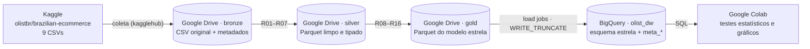

# MVP — Pipeline de dados em nuvem: atrasos de entrega no e-commerce brasileiro

[](https://colab.research.google.com/github/jplc08/mvp-pipeline-entregas-olist/blob/main/notebooks/mvp_pipeline_entregas_olist.ipynb)


| | |
|---|---|
| **Instituição** | Universidade de Brasília (UnB) — Departamento de Engenharia de Produção |
| **Disciplina** | Sistemas de Suporte à Decisão |
| **Professor** | André Luiz Marques Serrano |
| **Aluno** | João Pedro Lima de Carvalho — matrícula 231013402 |
| **Natureza** | Trabalho individual |

> **Resumo.** Um marketplace promete uma data de entrega em cada compra, e parte dessas promessas é quebrada. Este MVP constrói um pipeline de dados em nuvem, com **Google Drive** como Data Lake (camadas bronze, silver e gold) e **Google BigQuery** como Data Warehouse em esquema estrela, sobre ~100 mil pedidos reais da Olist (2016–2018). Com ele, responde a cinco perguntas de negócio que apoiam uma decisão: **onde agir para reduzir entregas atrasadas** (promessa de prazo, vendedores ou transporte) e **quanto o atraso custa em satisfação do cliente**.

## Sumário

1. [Objetivo](#1-objetivo)
2. [Arquitetura e plataforma](#2-arquitetura-e-plataforma)
3. [Como reproduzir](#3-como-reproduzir)
4. [Busca e coleta](#4-busca-e-coleta)
5. [Qualidade dos dados](#5-qualidade-dos-dados)
6. [Transformação](#6-transformação)
7. [Modelagem e Catálogo de Dados](#7-modelagem-e-catálogo-de-dados)
8. [Carga no Data Warehouse](#8-carga-no-data-warehouse)
9. [Análise: solução do problema](#9-análise-solução-do-problema)
10. [Discussão geral](#10-discussão-geral)
11. [Viabilidade financeira](#11-viabilidade-financeira)
12. [Autoavaliação](#12-autoavaliação)
13. [Ética, licenciamento e proteção de dados](#13-ética-licenciamento-e-proteção-de-dados)
14. [Estrutura do repositório](#14-estrutura-do-repositório)
15. [Referências](#15-referências)

---

## 1. Objetivo

### Problema

O e-commerce brasileiro opera sobre uma malha logística desigual: vendedores concentrados no Sudeste despacham para clientes em todo o país. A Olist, marketplace que conecta pequenos vendedores a grandes canais de venda, promete uma data de entrega no momento da compra. Quando a promessa é quebrada, o custo aparece em avaliações negativas, contatos com o atendimento e perda de recompra.

A decisão a apoiar é **onde agir para reduzir os atrasos**: recalibrar o prazo prometido por região, cobrar o prazo de postagem dos vendedores ou atacar o transporte nas rotas longas. Hoje não se sabe quanto cada fator explica o atraso, nem quanto ele custa em satisfação.

### Perguntas de negócio

| # | Pergunta | Decisão que a resposta apoia |
|---|---|---|
| **P1** | Qual é a taxa de entregas atrasadas (entrega depois da data prometida) e como ela evoluiu mês a mês entre jan/2017 e ago/2018? | Dimensionar o problema e identificar picos que pedem reforço de capacidade. |
| **P2** | Quais estados de destino concentram os maiores atrasos, e o prazo prometido está calibrado para a realidade de cada estado? | Recalibrar o prazo prometido por UF. |
| **P3** | Qual é a relação entre a distância vendedor → cliente e a probabilidade de atraso, e esse efeito se mantém quando se controlam região de destino, peso e mês da compra? | Priorizar rotas e transportadoras de longa distância. |
| **P4** | Em que etapa o atraso nasce — na preparação pelo vendedor (postagem depois do prazo-limite) ou no transporte — e quão concentrados os atrasos estão em poucos vendedores? | Criar um SLA de postagem e um programa de acompanhamento de vendedores. |
| **P5** | Quanto o atraso reduz a nota de avaliação do cliente e a proporção de avaliações negativas (1 ou 2 estrelas)? | Quantificar o custo do atraso em satisfação e justificar o investimento. |

### Hipóteses e critérios de confirmação (definidos antes da análise)

| Hipótese | Enunciado | Critério de confirmação |
|---|---|---|
| **H2** | O prazo prometido não compensa as diferenças regionais. | Entre as UFs com ≥ 300 entregas, a taxa de atraso da mais afetada é **≥ 3×** a da menos afetada. |
| **H3** | A distância aumenta o risco de atraso, mesmo com controles. | Taxa na faixa ≥ 2.000 km **≥ 1,5×** a da faixa até 100 km **e** razão de chances ajustada por +500 km **> 1** (IC 95% acima de 1). |
| **H4** | Parte relevante do atraso nasce no vendedor. | Taxa de atraso com postagem fora do prazo **≥ 2×** a taxa com postagem no prazo (qui-quadrado, p < 0,05). |
| **H5** | O atraso derruba a satisfação do cliente. | Nota média no prazo − nota média atrasado **≥ 1 ponto** (Mann-Whitney, p < 0,05). |

As hipóteses são numeradas pela pergunta que as testa; P1 é descritiva (linha de base). **Escopo:** compras de jan/2017 a ago/2018; métricas de entrega só para remessas entregues. **Fora do escopo:** previsão de atraso com aprendizado de máquina, pagamentos, categorias de produto e custo das transportadoras (ausente da base).

### As três dimensões do MVP

| Dimensão | Evidência neste trabalho |
|---|---|
| Viabilidade técnica | Pipeline ponta a ponta no Colab, com dados persistidos no Drive e no BigQuery ([seções 4 a 8](#4-busca-e-coleta)). |
| Viabilidade financeira | Consumo de armazenamento e de consulta **medido** e custo estimado ([seção 11](#11-viabilidade-financeira)). |
| Desejabilidade | P1 a P5 respondidas com dados e discutidas criticamente ([seções 9 e 10](#9-análise-solução-do-problema)). |

## 2. Arquitetura e plataforma



| Camada | Onde | Formato | Conteúdo |
|---|---|---|---|
| Bronze | Drive · `mvp_olist/bronze/olist/data_coleta=AAAA-MM-DD/` | CSV | Os 9 arquivos exatamente como baixados + `_metadados_coleta.json` (data, versão, linhas, SHA-256) |
| Silver | Drive · `mvp_olist/silver/` | Parquet | Tabelas limpas, tipadas, deduplicadas e padronizadas |
| Gold | Drive · `mvp_olist/gold/` **e** BigQuery · `olist_dw` | Parquet + tabelas | `fato_entrega`, `dim_tempo`, `dim_localidade`, `dim_vendedor` + 5 tabelas `meta_*` |

**Por que essa plataforma.** O **Colab** executa todo o pipeline em Python, sem instalação, e se integra nativamente ao Drive e ao BigQuery. O **Drive** é um armazenamento em nuvem persistente, organizado em camadas (arquitetura *medallion*). O **BigQuery Sandbox** é um Data Warehouse gratuito, que não exige cartão de crédito. Suas duas limitações foram tratadas no desenho do pipeline:

* **Sem DML (INSERT/UPDATE/MERGE):** a carga usa *load jobs* com `WRITE_TRUNCATE`, o que a torna **idempotente**. Reexecutar substitui as tabelas, sem duplicar linhas.
* **Tabelas expiram em 60 dias:** a camada gold fica também em Parquet no Drive, de onde é recarregada no BigQuery com uma única execução.

## 3. Como reproduzir

1. Crie um projeto no Google Cloud (<https://console.cloud.google.com/projectcreate>) e abra o console do BigQuery uma vez para ativar o *sandbox*. Anote o **ID do projeto**.
2. Clique em **Abrir no Colab** (topo desta página), preencha `PROJECT_ID` na célula de parâmetros e execute **Ambiente de execução → Executar tudo**.
3. Autorize o acesso ao Google Drive e à conta Google. O download do Kaggle não exige login, porque o conjunto é público. Se falhar, o notebook usa um plano B: arquivos enviados manualmente para `mvp_olist/upload_manual/`.
4. Ao final, o notebook baixa `evidencias_mvp_olist.zip`, já na estrutura deste repositório (`evidencias/`, `catalogo/`, `scripts/sql/`).

Fora do Colab, a coleta pode ser reproduzida com [`scripts/coleta_olist.py`](scripts/coleta_olist.py), e o modelo recriado com [`scripts/ddl_modelo_estrela.sql`](scripts/ddl_modelo_estrela.sql).

## 4. Busca e coleta

**Fonte:** [Brazilian E-Commerce Public Dataset by Olist](https://www.kaggle.com/datasets/olistbr/brazilian-ecommerce) (Kaggle), com pedidos reais de 2016 a 2018. A base foi escolhida **depois** do problema, por conter exatamente o que as perguntas exigem: data prometida × data real de entrega; datas de aprovação, postagem e prazo-limite de postagem (etapas do processo); CEP de origem e destino com tabela de geolocalização; nota de avaliação; e peso, frete e vendedor como controles.

**Coleta:** API pública do Kaggle via `kagglehub`, sem *web scraping*. Os arquivos são copiados sem alteração para a camada bronze no Drive, e os metadados de reprodutibilidade ficam em [`evidencias/metadados/_metadados_coleta.json`](evidencias/metadados/_metadados_coleta.json).

| Arquivo | Conteúdo | Linhas* |
|---|---|---:|
| `olist_orders_dataset.csv` | Pedidos, status e datas do ciclo | 99.441 |
| `olist_order_items_dataset.csv` | Itens, vendedor, preço, frete e prazo-limite de postagem | 112.650 |
| `olist_customers_dataset.csv` | Cliente por pedido e CEP-prefixo | 99.441 |
| `olist_sellers_dataset.csv` | Vendedores e CEP-prefixo | 3.095 |
| `olist_products_dataset.csv` | Produtos, categoria e dimensões | 32.951 |
| `olist_order_reviews_dataset.csv` | Avaliações | 99.224 |
| `olist_order_payments_dataset.csv` | Pagamentos (coletado, fora do escopo) | 103.886 |
| `olist_geolocation_dataset.csv` | Coordenadas por CEP-prefixo | 1.000.163 |
| `product_category_name_translation.csv` | Tradução das categorias | 71 |

\* Contagens da versão 2 do conjunto no Kaggle. A contagem exata da execução, a data da coleta, o volume (~120 MB, CSV UTF-8) e o hash de cada arquivo ficam registrados em `_metadados_coleta.json`.

**Data da coleta:** _AAAA-MM-DD (preencher com a data registrada em `_metadados_coleta.json`)._

> Evidência: [`evidencias/01_drive_bronze.png`](evidencias/01_drive_bronze.png)

## 5. Qualidade dos dados

A análise de qualidade foi feita **antes** da transformação, porque é ela que define as regras de tratamento. Tem três partes (Seção 5 do notebook):

1. **Perfil de todos os 52 atributos** dos 9 arquivos: tipo esperado, nulos, distintos, % de conformidade ao tipo, mínimo/máximo e valores mais frequentes → [`q1_perfil_por_atributo.csv`](evidencias/tabelas/q1_perfil_por_atributo.csv).
2. **43 verificações por dimensão de qualidade**, cada uma com o tratamento adotado. As que não encontram problema também ficam registradas → [`q2_verificacoes_por_dimensao.csv`](evidencias/tabelas/q2_verificacoes_por_dimensao.csv).
3. **Atualidade:** volume mensal e pedidos em aberto, que definem a janela de análise.

| Dimensão | O que foi examinado | Tratamento |
|---|---|---|
| Completude | Nulos em todos os atributos; pedidos "delivered" sem data de entrega; produtos sem categoria ou peso; pedidos sem itens | R06, R08, R09 |
| Unicidade | Chaves de todas as tabelas; avaliações repetidas por pedido; duplicatas na geolocalização | R04, R05, R07 |
| Consistência | Ordem compra → aprovação → postagem → entrega; status × datas | R09 (duração negativa → nulo + flag) |
| Conformidade | Tipos, *hashes* de 32 caracteres, UFs, CEP com 5 dígitos, notas 1–5, grafias de cidades, tradução de categorias | R01, R02, R03, R06 |
| Acurácia | Coordenadas fora do Brasil, peso zero, preços e fretes impossíveis, prazos extremos | R04, R06; extremos mantidos e sinalizados |
| Integridade | Chaves estrangeiras entre as tabelas; CEPs sem geolocalização | R12 (distância nula) |
| Atualidade | Volume e pedidos em aberto por mês | R13 (janela jan/2017–ago/2018) |


Os meses de 2016 têm volume irrisório e descontínuo, e os posteriores a ago/2018 estão truncados: foram extraídos com pedidos ainda em aberto. Incluí-los **subestimaria a taxa de atraso**, porque os pedidos atrasados daqueles meses ainda não teriam sido entregues (viés de truncamento). Depois da carga, a qualidade é verificada de novo no próprio Data Warehouse (seção 8) e contra os domínios do catálogo (seção 7).

## 6. Transformação

Dezesseis regras de negócio (R01–R16) transformam a bronze em silver e a silver no modelo estrela. Cada uma registra quantas linhas afetou em `meta_log_transformacoes` (BigQuery), compondo a linhagem. A lista completa, com justificativas e conversões de unidade, está em [`catalogo/regras_transformacao.md`](catalogo/regras_transformacao.md). As regras de maior impacto na interpretação dos resultados são:

* **R08 — grão da fato = remessa (pedido × vendedor):** itens agregados por pedido e vendedor; o prazo-limite de postagem é o maior entre os itens.
* **R09 — etapas e consistência:** aprovação, preparação (vendedor), transporte (transportadora) e prazo total em dias. Durações negativas viram nulo e são sinalizadas. Só conta como "entregue" o status `delivered` com data de entrega.
* **R10 — definição de atraso:** data da entrega posterior à data prometida (dias corridos). Entregar no próprio dia prometido não é atraso.
* **R12 — distância:** Haversine entre os centroides dos CEPs de origem e destino (linha reta, não rota rodoviária).
* **R14 — minimização (LGPD):** identificador único do cliente e texto livre das avaliações não seguem para as camadas silver e gold.

## 7. Modelagem e Catálogo de Dados


**Esquema estrela** com a fato `fato_entrega` e três dimensões. `dim_tempo` e `dim_localidade` são dimensões com papéis: compra/prevista/entrega e origem/destino. O **grão é a remessa (pedido × vendedor)**. O grão por item repetiria datas e nota em cada item, e o grão por pedido perderia o vendedor nos pedidos com mais de um vendedor. A justificativa completa e o diagrama entidade-relacionamento estão em [`catalogo/modelo_dados.md`](catalogo/modelo_dados.md).

O **[Catálogo de Dados](catalogo/catalogo_dados.md)** descreve os 54 atributos do modelo: tipo, descrição, domínio (faixa mínima e máxima esperada, valores válidos ou padrão), obrigatoriedade, significado do nulo e linhagem. Ele é definido **uma única vez** no notebook e dele saem três produtos:

1. a documentação (`catalogo_dados.md` / `.csv`);
2. o esquema do BigQuery: tipos, `REQUIRED`/`NULLABLE` e a **descrição de cada coluna**, visível no console ([`evidencias/04_bigquery_esquema_fato.png`](evidencias/04_bigquery_esquema_fato.png));
3. a **validação automática** dos dados contra os domínios declarados, antes da carga ([`m2_validacao_catalogo.csv`](evidencias/tabelas/m2_validacao_catalogo.csv)).

## 8. Carga no Data Warehouse

Pipeline ETL: extração (seção 4) → transformação em pandas (seções 6 e 7) → carga no BigQuery por *load jobs* com:

* **esquema explícito gerado do catálogo:** uma coluna obrigatória com nulo faz a carga falhar, funcionando como trava de integridade;
* **`WRITE_TRUNCATE`:** carga idempotente, compatível com a ausência de DML no sandbox;
* **descrições de tabela e de coluna** gravadas nos metadados do BigQuery.

Depois da carga, o notebook **relê do BigQuery** e verifica:

| Verificação | Evidência |
|---|---|
| Contagem de linhas Drive × BigQuery em cada uma das 9 tabelas | [`c1_log_carga.csv`](evidencias/tabelas/c1_log_carga.csv) |
| Unicidade das chaves e 6 chaves estrangeiras sem registros órfãos (SQL) | [`c2_integridade_referencial.csv`](evidencias/tabelas/c2_integridade_referencial.csv) · [`c2_integridade_referencial.sql`](scripts/sql/c2_integridade_referencial.sql) |
| Reconciliação de contagens e somas (remessas, pedidos, valor, frete, entregues, atrasadas) | [`c3_reconciliacao.csv`](evidencias/tabelas/c3_reconciliacao.csv) |

> Evidências no console: [`03_bigquery_dataset.png`](evidencias/03_bigquery_dataset.png) · [`04_bigquery_esquema_fato.png`](evidencias/04_bigquery_esquema_fato.png) · [`05_bigquery_preview.png`](evidencias/05_bigquery_preview.png)

## 9. Análise: solução do problema

Todas as respostas partem de **SQL executado no BigQuery** sobre o modelo estrela (arquivos em [`scripts/sql/`](scripts/sql)). O Python entra depois, para os testes estatísticos e os gráficos. **Universo:** remessas entregues com compra na janela de análise. **Incerteza:** as taxas vêm com IC 95% (Wilson), e as comparações com teste de hipótese.

> Os números abaixo vêm da execução do notebook. A leitura completa, gerada automaticamente a partir dos resultados, está em [`evidencias/resultados_resumo.md`](evidencias/resultados_resumo.md).

### P1 — Taxa de atraso e evolução mensal

**Método:** taxa mensal pelo mês da compra; prazo realizado × prometido; comparação jan–ago de 2017 × 2018 (qui-quadrado); correlação volume × taxa (Spearman). SQL: [`p1_taxa_atraso_mensal.sql`](scripts/sql/p1_taxa_atraso_mensal.sql).


**Resultado:** _ver P1 em `resultados_resumo.md`._

**Discussão.** A taxa média dimensiona o problema, e a série mostra se ele é estável. Picos concentrados em poucos meses indicam **choques de capacidade**: datas promocionais como a Black Friday, ou eventos que travam a malha logística, como a greve dos caminhoneiros de maio de 2018. Choques assim não se resolvem com um prazo fixo. Se a promessa é folgada **na média** e mesmo assim o atraso é relevante, o prazo está sendo definido sem considerar a **dispersão** do tempo de entrega.

### P2 — Estados de destino e calibração da promessa

**Método:** taxa por UF com IC 95%; UF "significativamente acima da média" quando o limite inferior do IC supera a taxa nacional. Calibração: prazo **mediano prometido** × **P90 do prazo realizado** por UF. SQL: [`p2_atraso_por_uf.sql`](scripts/sql/p2_atraso_por_uf.sql).


**Resultado:** _ver P2 em `resultados_resumo.md`._

**Discussão.** Com uma promessa bem calibrada, o risco de atraso seria parecido em todos os estados, porque o prazo maior compensaria o destino mais difícil. Nas UFs em que o P90 realizado supera a promessa, a solução mais barata é **alongar a promessa**, não acelerar a entrega. Nas UFs em que a promessa já supera o P90, a plataforma **perde competitividade à toa**.

### P3 — Distância e risco de atraso

**Método:** taxa por faixa de distância e **regressão logística** controlando região de destino, peso, postagem fora do prazo e mês (efeitos fixos). Resultados em razão de chances (OR) com IC 95%. SQL: [`p3_atraso_por_distancia.sql`](scripts/sql/p3_atraso_por_distancia.sql) · [`p3_base_regressao.sql`](scripts/sql/p3_base_regressao.sql).


**Resultado:** _ver P3 em `resultados_resumo.md`._

**Discussão.** A comparação entre o OR **bruto** e o **ajustado** é o ponto central. Se o efeito encolhe ao incluir a região de destino, parte do que parecia "distância" é **qualidade da malha no destino**. Se o efeito se mantém, rotas longas pedem transportadoras ou modais diferentes. Limitações: distância em linha reta e ausência de transportadora e rota na base.

### P4 — Etapa de origem e concentração por vendedor

**Método:** decomposição do prazo em aprovação, preparação (vendedor) e transporte (transportadora), comparando atrasadas e no prazo; taxa de atraso por cumprimento do prazo de postagem (qui-quadrado); curva de concentração dos atrasos por vendedor. SQL: [`p4_etapas_por_grupo.sql`](scripts/sql/p4_etapas_por_grupo.sql) · [`p4_atraso_por_postagem.sql`](scripts/sql/p4_atraso_por_postagem.sql) · [`p4_atraso_por_vendedor.sql`](scripts/sql/p4_atraso_por_vendedor.sql).


**Resultado:** _ver P4 em `resultados_resumo.md`._

**Discussão.** A **taxa** mostra quanto postar fora do prazo multiplica o risco. A **contribuição** mostra quanto do atraso total nasce em cada etapa. Uma etapa pode ter taxa alta e contribuição pequena, se for rara. A curva de atrasos acima da curva de volume indica vendedores que atrasam **desproporcionalmente**, alvo natural de um SLA de postagem.

### P5 — Custo do atraso em satisfação

**Método:** análise **por pedido** (atrasado se qualquer remessa atrasou); nota média e % de avaliações negativas por faixa de antecipação/atraso; Mann-Whitney e IC da diferença de médias (Welch). SQL: [`p5_nota_por_faixa_de_atraso.sql`](scripts/sql/p5_nota_por_faixa_de_atraso.sql) · [`p5_base_pedidos.sql`](scripts/sql/p5_base_pedidos.sql).


**Resultado:** _ver P5 em `resultados_resumo.md`._

**Discussão.** A **forma** da relação importa. Se antecipar melhora pouco a nota, enquanto cada faixa de atraso a derruba (assimetria), prometer um pouco mais e cumprir custa menos satisfação do que prometer pouco e atrasar, o que reforça a promessa calibrada de P2. Se os pedidos atrasados, que são minoria, geram uma parcela desproporcional das avaliações negativas, reduzir atrasos é a alavanca mais eficiente para a reputação. Cautela: a análise é observacional, e atrasos podem vir acompanhados de outros problemas (avaria, produto errado).

## 10. Discussão geral

A avaliação de cada hipótese contra o critério pré-definido está em [`d1_avaliacao_hipoteses.csv`](evidencias/tabelas/d1_avaliacao_hipoteses.csv) e na Seção 10 do notebook.

**Como as respostas se encadeiam.** P1 dimensiona o problema e mostra como ele oscila no tempo. P2 e P3 mostram **onde** ele se concentra e se a promessa de prazo absorve essas diferenças. P4 mostra **em que etapa** nasce. P5 mostra **quanto custa**. A priorização abaixo vale para o cenário em que as hipóteses se confirmam; uma hipótese não confirmada rebaixa a ação correspondente.

| Prioridade | Ação | Evidência | Custo de implantação |
|---|---|---|---|
| 1 | **Calibrar a promessa de prazo** por UF de destino e faixa de distância (por exemplo, P90 do prazo realizado, recalculado mensalmente). | P2, P3, P5 | Baixo: regra de negócio no *checkout*. |
| 2 | **Atacar o transporte nas rotas longas** para as regiões com maior razão de chances. | P3, P4 | Médio: negociação comercial. |
| 3 | **SLA de postagem focado** nos vendedores do topo da curva de concentração, com alerta automático. | P4 | Baixo: monitoramento sobre o próprio DW. |
| 4 | **Plano de capacidade para picos** previsíveis, com promessa temporariamente estendida. | P1 | Baixo a médio. |

**O que os dados não permitem concluir.** As análises são observacionais (associação, não causalidade). A base não identifica transportadora, modal nem rota; a distância é em linha reta; e o período é anterior à expansão do e-commerce na pandemia. As conclusões são **hipóteses de ação** a validar com um experimento controlado, como um teste A/B da promessa calibrada em algumas UFs.

## 11. Viabilidade financeira

O notebook registra os bytes processados por **cada** consulta e o armazenamento ocupado ([`f1_consultas_bigquery.csv`](evidencias/tabelas/f1_consultas_bigquery.csv), [`f2_custos.csv`](evidencias/tabelas/f2_custos.csv)).

| Recurso | Franquia gratuita | Uso do MVP |
|---|---|---|
| BigQuery — consultas | 1 TiB por mês | Ordem de dezenas de MB por execução completa |
| BigQuery — armazenamento | 10 GiB | Ordem de dezenas de MB (modelo estrela + metadados) |
| Google Drive | 15 GB por conta | Ordem de 150 MB (bronze + silver + gold) |
| Google Colab | Uso gratuito com limites | 1 sessão de CPU |

Mesmo com execução diária, o consumo fica em uma fração ínfima das franquias: **custo operacional de US$ 0,00**. Sem franquia nenhuma, uma execução custaria centavos de dólar (preço de referência sob demanda: US$ 6,25 por TiB processado). Os valores exatos da execução estão em `resultados_resumo.md`.

## 12. Autoavaliação

**Perguntas respondidas.** P1, P2 e P5 foram respondidas integralmente. P3 foi respondida com ressalva (distância em linha reta; sem transportadora nem rota). P4 foi respondida **parcialmente**: separa vendedor × transporte, mas não identifica qual transportadora ou centro de distribuição causa o atraso, porque a base não traz essa informação. Nenhuma pergunta foi removida.

**Limitações dos dados.** (i) **Atualidade:** 2016–2018, antes das mudanças logísticas da pandemia; os padrões validam o método, não retratam o presente. (ii) **Granularidade:** sem transportadora, modal, rota nem postagem por item; geolocalização por CEP-prefixo de 5 dígitos. (iii) A **regra** que a Olist usa para calcular a data prometida é desconhecida. (iv) Avaliações não são obrigatórias, o que gera viés de resposta. (v) As regras de tratamento de qualidade foram documentadas, mas cada uma é uma escolha que afeta o resultado na margem.

**O que eu faria diferente.** Usaria uma plataforma com carga **incremental** (`MERGE` no BigQuery com faturamento ativo, ou Databricks com Delta Lake), sem expiração de tabelas. Declararia as regras de qualidade como **testes automatizados** (dbt tests / Great Expectations). Modelaria também uma fato de itens com `dim_produto`. E separaria o notebook em módulos orquestrados.

**Extensões para uso contínuo.** (1) Ingestão agendada e incremental a partir da fonte transacional. (2) Painel no Looker Studio sobre o `olist_dw`, com as métricas de P1 a P5 e alertas por UF e por vendedor. (3) Modelo preditivo de atraso no *checkout* para ajustar a promessa pedido a pedido. (4) Teste A/B da promessa calibrada para passar da associação à causalidade.

**Dificuldades.** Escolher o grão da fato (resolvido com a remessa); tratar a geolocalização (1 milhão de pontos, com duplicatas e coordenadas no exterior); adaptar o pipeline às limitações do BigQuery Sandbox; e identificar o viés de truncamento nos meses finais da base.

## 13. Ética, licenciamento e proteção de dados

* **Licença dos dados:** CC BY-NC-SA 4.0. Uso com atribuição à Olist, sem fins comerciais, e derivados sob a mesma licença. Este trabalho é acadêmico. **Os dados brutos não são versionados** neste repositório: o script de coleta os obtém da fonte oficial. Detalhes em [`LICENSE`](LICENSE).
* **LGPD (Lei nº 13.709/2018):** a base é publicada anonimizada pela Olist, com identificadores em *hash*, sem nomes, documentos ou endereços completos, e com as referências a empresas nos comentários substituídas por nomes fictícios. Como proteção adicional, o pipeline aplica **minimização** (R14): o identificador único do cliente e o texto livre das avaliações não entram nas camadas silver e gold.
* **Dados corporativos:** não foram usados.
* **Licença do código:** MIT.

## 14. Estrutura do repositório

```
mvp-pipeline-entregas-olist/
├── README.md                          ← este documento
├── LICENSE                            ← licença do código (MIT) + registro da licença dos dados
├── requirements.txt
├── notebooks/
│   └── mvp_pipeline_entregas_olist.ipynb   ← pipeline completo (coleta → análise), executado no Colab
├── scripts/
│   ├── coleta_olist.py                ← coleta reproduzível da camada bronze
│   ├── ddl_modelo_estrela.sql         ← DDL do modelo estrela (gerado do catálogo)
│   └── sql/                           ← SQL executado no BigQuery (integridade, reconciliação, P1–P5)
├── catalogo/
│   ├── catalogo_dados.md / .csv       ← Catálogo de Dados (54 atributos, domínios e linhagem)
│   ├── modelo_dados.md                ← grão, tabelas, diagrama ER e linhagem
│   ├── modelo_estrela.png             ← diagrama do esquema estrela
│   └── regras_transformacao.md        ← regras R01–R16 e conversões
└── evidencias/
    ├── README.md                      ← roteiro das evidências
    ├── graficos/ · tabelas/ · metadados/   ← gerados pela execução
    ├── resultados_resumo.md           ← leitura automática dos resultados
    └── 01_…07_*.png                   ← capturas de tela do Drive, BigQuery e Colab
```

## 15. Referências

* OLIST. *Brazilian E-Commerce Public Dataset by Olist*. Kaggle, 2018. <https://www.kaggle.com/datasets/olistbr/brazilian-ecommerce>.
* BRASIL. Lei nº 13.709, de 14 de agosto de 2018 — Lei Geral de Proteção de Dados Pessoais.
* KIMBALL, R.; ROSS, M. *The Data Warehouse Toolkit*. 3. ed. Wiley, 2013.
* GOOGLE CLOUD. *BigQuery sandbox* e *BigQuery pricing*. <https://cloud.google.com/bigquery/docs/sandbox> · <https://cloud.google.com/bigquery/pricing>.
* WILSON, E. B. Probable inference, the law of succession, and statistical inference. *JASA*, v. 22, n. 158, p. 209–212, 1927.
