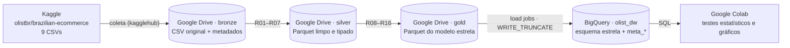

# MVP — Pipeline de dados em nuvem: atrasos de entrega no e-commerce brasileiro

[](https://colab.research.google.com/github/jplc08/mvp-pipeline-entregas-olist/blob/main/notebooks/mvp_pipeline_entregas_olist.ipynb)


| | |
|---|---|
| **Instituição** | Universidade de Brasília (UnB) — Departamento de Engenharia de Produção |
| **Disciplina** | Sistemas de Suporte à Decisão |
| **Professor** | André Luiz Marques Serrano |
| **Aluno** | João Pedro Lima de Carvalho — matrícula 231013402 |
| **Natureza** | Trabalho individual |

> **Resumo.** Um marketplace promete uma data de entrega em cada compra, e parte dessas promessas é quebrada. Este MVP constrói um pipeline de dados em nuvem, com **Google Drive** como Data Lake (camadas bronze, silver e gold) e **Google BigQuery** como Data Warehouse em esquema estrela, sobre ~100 mil pedidos reais da Olist (2016–2018). Com ele, responde a cinco perguntas de negócio que apoiam uma decisão: **onde agir para reduzir entregas atrasadas** (promessa de prazo, vendedores ou transporte) e **quanto o atraso custa em satisfação do cliente**.

### Principais resultados

* **6,7%** das remessas entregues chegam depois da data prometida, com picos de até **18,8%** (mar/2018) e **21,4%** em Alagoas.
* A promessa de prazo está **desbalanceada**: curta demais para AL, RR, SE, MA e RJ (até 9 dias abaixo do P90 realizado) e longa demais para AP, AC, RO e AM (até 12 dias acima).
* O atraso se materializa no **transporte**: 87% dos dias extras das entregas atrasadas acontecem depois da postagem. O vendedor que posta fora do prazo multiplica o risco por 3,9, mas responde por 27,7% dos atrasos.
* O atraso **custa 2 pontos** na nota do cliente (4,29 → 2,27), e 6,7% dos pedidos, os atrasados, geram **um terço** das avaliações negativas.
* As **quatro hipóteses** definidas antes da análise foram **confirmadas**. Custo operacional do pipeline: **US$ 0,00**.

## Sumário

1. [Objetivo](#1-objetivo)
2. [Arquitetura e plataforma](#2-arquitetura-e-plataforma)
3. [Como reproduzir](#3-como-reproduzir)
4. [Busca e coleta](#4-busca-e-coleta)
5. [Qualidade dos dados](#5-qualidade-dos-dados)
6. [Transformação](#6-transformação)
7. [Modelagem e Catálogo de Dados](#7-modelagem-e-catálogo-de-dados)
8. [Carga no Data Warehouse](#8-carga-no-data-warehouse)
9. [Análise: solução do problema](#9-análise-solução-do-problema)
10. [Discussão geral](#10-discussão-geral)
11. [Viabilidade financeira](#11-viabilidade-financeira)
12. [Autoavaliação](#12-autoavaliação)
13. [Ética, licenciamento e proteção de dados](#13-ética-licenciamento-e-proteção-de-dados)
14. [Estrutura do repositório](#14-estrutura-do-repositório)
15. [Referências](#15-referências)

---

## 1. Objetivo

### Problema

O e-commerce brasileiro opera sobre uma malha logística desigual: vendedores concentrados no Sudeste despacham para clientes em todo o país. A Olist, marketplace que conecta pequenos vendedores a grandes canais de venda, promete uma data de entrega no momento da compra. Quando a promessa é quebrada, o custo aparece em avaliações negativas, contatos com o atendimento e perda de recompra.

A decisão a apoiar é **onde agir para reduzir os atrasos**: recalibrar o prazo prometido por região, cobrar o prazo de postagem dos vendedores ou atacar o transporte nas rotas longas. Hoje não se sabe quanto cada fator explica o atraso, nem quanto ele custa em satisfação.

### Perguntas de negócio

| # | Pergunta | Decisão que a resposta apoia |
|---|---|---|
| **P1** | Qual é a taxa de entregas atrasadas (entrega depois da data prometida) e como ela evoluiu mês a mês entre jan/2017 e ago/2018? | Dimensionar o problema e identificar picos que pedem reforço de capacidade. |
| **P2** | Quais estados de destino concentram os maiores atrasos, e o prazo prometido está calibrado para a realidade de cada estado? | Recalibrar o prazo prometido por UF. |
| **P3** | Qual é a relação entre a distância vendedor → cliente e a probabilidade de atraso, e esse efeito se mantém quando se controlam região de destino, peso e mês da compra? | Priorizar rotas e transportadoras de longa distância. |
| **P4** | Em que etapa o atraso nasce — na preparação pelo vendedor (postagem depois do prazo-limite) ou no transporte — e quão concentrados os atrasos estão em poucos vendedores? | Criar um SLA de postagem e um programa de acompanhamento de vendedores. |
| **P5** | Quanto o atraso reduz a nota de avaliação do cliente e a proporção de avaliações negativas (1 ou 2 estrelas)? | Quantificar o custo do atraso em satisfação e justificar o investimento. |

### Hipóteses e critérios de confirmação (definidos antes da análise)

| Hipótese | Enunciado | Critério de confirmação |
|---|---|---|
| **H2** | O prazo prometido não compensa as diferenças regionais. | Entre as UFs com ≥ 300 entregas, a taxa de atraso da mais afetada é **≥ 3×** a da menos afetada. |
| **H3** | A distância aumenta o risco de atraso, mesmo com controles. | Taxa na faixa ≥ 2.000 km **≥ 1,5×** a da faixa até 100 km **e** razão de chances ajustada por +500 km **> 1** (IC 95% acima de 1). |
| **H4** | Parte relevante do atraso nasce no vendedor. | Taxa de atraso com postagem fora do prazo **≥ 2×** a taxa com postagem no prazo (qui-quadrado, p < 0,05). |
| **H5** | O atraso derruba a satisfação do cliente. | Nota média no prazo − nota média atrasado **≥ 1 ponto** (Mann-Whitney, p < 0,05). |

As hipóteses são numeradas pela pergunta que as testa; P1 é descritiva (linha de base). **Escopo:** compras de jan/2017 a ago/2018; métricas de entrega só para remessas entregues. **Fora do escopo:** previsão de atraso com aprendizado de máquina, pagamentos, categorias de produto e custo das transportadoras (ausente da base).

### As três dimensões do MVP

| Dimensão | Evidência neste trabalho |
|---|---|
| Viabilidade técnica | Pipeline ponta a ponta no Colab, com dados persistidos no Drive e no BigQuery ([seções 4 a 8](#4-busca-e-coleta)). |
| Viabilidade financeira | Consumo de armazenamento e de consulta **medido** e custo estimado ([seção 11](#11-viabilidade-financeira)). |
| Desejabilidade | P1 a P5 respondidas com dados e discutidas criticamente ([seções 9 e 10](#9-análise-solução-do-problema)). |

## 2. Arquitetura e plataforma



| Camada | Onde | Formato | Conteúdo |
|---|---|---|---|
| Bronze | Drive · `mvp_olist/bronze/olist/data_coleta=AAAA-MM-DD/` | CSV | Os 9 arquivos exatamente como baixados + `_metadados_coleta.json` (data, versão, linhas, SHA-256) |
| Silver | Drive · `mvp_olist/silver/` | Parquet | Tabelas limpas, tipadas, deduplicadas e padronizadas |
| Gold | Drive · `mvp_olist/gold/` **e** BigQuery · `olist_dw` | Parquet + tabelas | `fato_entrega`, `dim_tempo`, `dim_localidade`, `dim_vendedor` + 5 tabelas `meta_*` |

**Por que essa plataforma.** O **Colab** executa todo o pipeline em Python, sem instalação, e se integra nativamente ao Drive e ao BigQuery. O **Drive** é um armazenamento em nuvem persistente, organizado em camadas (arquitetura *medallion*). O **BigQuery Sandbox** é um Data Warehouse gratuito, que não exige cartão de crédito. Suas duas limitações foram tratadas no desenho do pipeline:

* **Sem DML (INSERT/UPDATE/MERGE):** a carga usa *load jobs* com `WRITE_TRUNCATE`, o que a torna **idempotente**. Reexecutar substitui as tabelas, sem duplicar linhas.
* **Tabelas expiram em 60 dias:** a camada gold fica também em Parquet no Drive, de onde é recarregada no BigQuery com uma única execução.

## 3. Como reproduzir

1. Crie um projeto no Google Cloud (<https://console.cloud.google.com/projectcreate>) e abra o console do BigQuery uma vez para ativar o *sandbox*. Anote o **ID do projeto**.
2. Clique em **Abrir no Colab** (topo desta página), preencha `PROJECT_ID` na célula de parâmetros e execute **Ambiente de execução → Executar tudo**.
3. Autorize o acesso ao Google Drive e à conta Google. O download do Kaggle não exige login, porque o conjunto é público. Se falhar, o notebook usa um plano B: arquivos enviados manualmente para `mvp_olist/upload_manual/`.
4. Ao final, o notebook baixa `evidencias_mvp_olist.zip`, já na estrutura deste repositório (`evidencias/`, `catalogo/`, `scripts/sql/`).

Fora do Colab, a coleta pode ser reproduzida com [`scripts/coleta_olist.py`](scripts/coleta_olist.py), e o modelo recriado com [`scripts/ddl_modelo_estrela.sql`](scripts/ddl_modelo_estrela.sql).

## 4. Busca e coleta

**Fonte:** [Brazilian E-Commerce Public Dataset by Olist](https://www.kaggle.com/datasets/olistbr/brazilian-ecommerce) (Kaggle), com pedidos reais de 2016 a 2018. A base foi escolhida **depois** do problema, por conter exatamente o que as perguntas exigem: data prometida × data real de entrega; datas de aprovação, postagem e prazo-limite de postagem (etapas do processo); CEP de origem e destino com tabela de geolocalização; nota de avaliação; e peso, frete e vendedor como controles.

**Coleta:** API pública do Kaggle via `kagglehub`, sem *web scraping*. Os arquivos são copiados sem alteração para a camada bronze no Drive, e os metadados de reprodutibilidade ficam em [`evidencias/metadados/_metadados_coleta.json`](evidencias/metadados/_metadados_coleta.json).

| Item | Valor registrado |
|---|---|
| **Data da coleta** | 28/09/2026, 18:15 (UTC-3) |
| **Formato original** | 9 arquivos CSV (UTF-8, separador vírgula) |
| **Volume** | 120,35 MB · 1.550.922 linhas |
| **Pasta na bronze** | `mvp_olist/bronze/olist/data_coleta=2026-09-28/` |

| Arquivo | Conteúdo | Linhas | Colunas | MB |
|---|---|---:|---:|---:|
| `olist_orders_dataset.csv` | Pedidos, status e datas do ciclo | 99.441 | 8 | 16,84 |
| `olist_order_items_dataset.csv` | Itens, vendedor, preço, frete e prazo-limite de postagem | 112.650 | 7 | 14,72 |
| `olist_customers_dataset.csv` | Cliente por pedido e CEP-prefixo | 99.441 | 5 | 8,62 |
| `olist_sellers_dataset.csv` | Vendedores e CEP-prefixo | 3.095 | 4 | 0,17 |
| `olist_products_dataset.csv` | Produtos, categoria e dimensões | 32.951 | 9 | 2,27 |
| `olist_order_reviews_dataset.csv` | Avaliações | 99.224 | 7 | 13,78 |
| `olist_order_payments_dataset.csv` | Pagamentos (coletado, fora do escopo) | 103.886 | 5 | 5,51 |
| `olist_geolocation_dataset.csv` | Coordenadas por CEP-prefixo | 1.000.163 | 5 | 58,44 |
| `product_category_name_translation.csv` | Tradução das categorias | 71 | 2 | < 0,01 |

O `kagglehub` não expôs o número de versão do conjunto no caminho de download. A identificação exata dos arquivos coletados fica garantida pelo **hash SHA-256** de cada um, registrado no `_metadados_coleta.json`: quem reexecutar a coleta consegue verificar se recebeu exatamente os mesmos arquivos.

> Evidência: [`evidencias/01_drive_bronze.png`](evidencias/01_drive_bronze.png)

## 5. Qualidade dos dados

A análise de qualidade foi feita **antes** da transformação, porque é ela que define as regras de tratamento. Tem três partes (Seção 5 do notebook):

1. **Perfil de todos os 52 atributos** dos 9 arquivos: tipo esperado, nulos, distintos, % de conformidade ao tipo, mínimo/máximo e valores mais frequentes → [`q1_perfil_por_atributo.csv`](evidencias/tabelas/q1_perfil_por_atributo.csv).
2. **43 verificações por dimensão de qualidade**, cada uma com o tratamento adotado. As que não encontram problema também ficam registradas → [`q2_verificacoes_por_dimensao.csv`](evidencias/tabelas/q2_verificacoes_por_dimensao.csv).
3. **Atualidade:** volume mensal e pedidos em aberto, que definem a janela de análise.

| Dimensão | O que foi examinado | Tratamento |
|---|---|---|
| Completude | Nulos em todos os atributos; pedidos "delivered" sem data de entrega; produtos sem categoria ou peso; pedidos sem itens | R06, R08, R09 |
| Unicidade | Chaves de todas as tabelas; avaliações repetidas por pedido; duplicatas na geolocalização | R04, R05, R07 |
| Consistência | Ordem compra → aprovação → postagem → entrega; status × datas | R09 (duração negativa → nulo + flag) |
| Conformidade | Tipos, *hashes* de 32 caracteres, UFs, CEP com 5 dígitos, notas 1–5, grafias de cidades, tradução de categorias | R01, R02, R03, R06 |
| Acurácia | Coordenadas fora do Brasil, peso zero, preços e fretes impossíveis, prazos extremos | R04, R06; extremos mantidos e sinalizados |
| Integridade | Chaves estrangeiras entre as tabelas; CEPs sem geolocalização | R12 (distância nula) |
| Atualidade | Volume e pedidos em aberto por mês | R13 (janela jan/2017–ago/2018) |


Os meses de 2016 têm volume irrisório e descontínuo, e os posteriores a ago/2018 estão truncados: foram extraídos com pedidos ainda em aberto. Incluí-los **subestimaria a taxa de atraso**, porque os pedidos atrasados daqueles meses ainda não teriam sido entregues (viés de truncamento). Depois da carga, a qualidade é verificada de novo no próprio Data Warehouse (seção 8) e contra os domínios do catálogo (seção 7).

## 6. Transformação

Dezesseis regras de negócio (R01–R16) transformam a bronze em silver e a silver no modelo estrela. Cada uma registra quantas linhas afetou em `meta_log_transformacoes` (BigQuery), compondo a linhagem. A lista completa, com justificativas e conversões de unidade, está em [`catalogo/regras_transformacao.md`](catalogo/regras_transformacao.md). As regras de maior impacto na interpretação dos resultados são:

* **R08 — grão da fato = remessa (pedido × vendedor):** itens agregados por pedido e vendedor; o prazo-limite de postagem é o maior entre os itens.
* **R09 — etapas e consistência:** aprovação, preparação (vendedor), transporte (transportadora) e prazo total em dias. Durações negativas viram nulo e são sinalizadas. Só conta como "entregue" o status `delivered` com data de entrega.
* **R10 — definição de atraso:** data da entrega posterior à data prometida (dias corridos). Entregar no próprio dia prometido não é atraso.
* **R12 — distância:** Haversine entre os centroides dos CEPs de origem e destino (linha reta, não rota rodoviária).
* **R14 — minimização (LGPD):** identificador único do cliente e texto livre das avaliações não seguem para as camadas silver e gold.

## 7. Modelagem e Catálogo de Dados


**Esquema estrela** com a fato `fato_entrega` e três dimensões. `dim_tempo` e `dim_localidade` são dimensões com papéis: compra/prevista/entrega e origem/destino. O **grão é a remessa (pedido × vendedor)**. O grão por item repetiria datas e nota em cada item, e o grão por pedido perderia o vendedor nos pedidos com mais de um vendedor. A justificativa completa e o diagrama entidade-relacionamento estão em [`catalogo/modelo_dados.md`](catalogo/modelo_dados.md).

O **[Catálogo de Dados](catalogo/catalogo_dados.md)** descreve os 54 atributos do modelo: tipo, descrição, domínio (faixa mínima e máxima esperada, valores válidos ou padrão), obrigatoriedade, significado do nulo e linhagem. Ele é definido **uma única vez** no notebook e dele saem três produtos:

1. a documentação (`catalogo_dados.md` / `.csv`);
2. o esquema do BigQuery: tipos, `REQUIRED`/`NULLABLE` e a **descrição de cada coluna**, visível no console ([`evidencias/04_bigquery_esquema_fato.png`](evidencias/04_bigquery_esquema_fato.png));
3. a **validação automática** dos dados contra os domínios declarados, antes da carga ([`m2_validacao_catalogo.csv`](evidencias/tabelas/m2_validacao_catalogo.csv)).

## 8. Carga no Data Warehouse

Pipeline ETL: extração (seção 4) → transformação em pandas (seções 6 e 7) → carga no BigQuery por *load jobs* com:

* **esquema explícito gerado do catálogo:** uma coluna obrigatória com nulo faz a carga falhar, funcionando como trava de integridade;
* **`WRITE_TRUNCATE`:** carga idempotente, compatível com a ausência de DML no sandbox;
* **descrições de tabela e de coluna** gravadas nos metadados do BigQuery.

Depois da carga, o notebook **relê do BigQuery** e verifica:

| Verificação | Evidência |
|---|---|
| Contagem de linhas Drive × BigQuery em cada uma das 9 tabelas | [`c1_log_carga.csv`](evidencias/tabelas/c1_log_carga.csv) |
| Unicidade das chaves e 6 chaves estrangeiras sem registros órfãos (SQL) | [`c2_integridade_referencial.csv`](evidencias/tabelas/c2_integridade_referencial.csv) · [`c2_integridade_referencial.sql`](scripts/sql/c2_integridade_referencial.sql) |
| Reconciliação de contagens e somas (remessas, pedidos, valor, frete, entregues, atrasadas) | [`c3_reconciliacao.csv`](evidencias/tabelas/c3_reconciliacao.csv) |

> Evidências no console: [`03_bigquery_dataset.png`](evidencias/03_bigquery_dataset.png) · [`04_bigquery_esquema_fato.png`](evidencias/04_bigquery_esquema_fato.png) · [`05_bigquery_preview.png`](evidencias/05_bigquery_preview.png)

## 9. Análise: solução do problema

Todas as respostas partem de **SQL executado no BigQuery** sobre o modelo estrela (arquivos em [`scripts/sql/`](scripts/sql)). O Python entra depois, para os testes estatísticos e os gráficos. **Universo:** remessas entregues com compra na janela de análise. **Incerteza:** as taxas vêm com IC 95% (Wilson), e as comparações com teste de hipótese.

> Os números abaixo vêm da execução do notebook. A leitura completa, gerada automaticamente a partir dos resultados, está em [`evidencias/resultados_resumo.md`](evidencias/resultados_resumo.md).

### P1 — Taxa de atraso e evolução mensal

**Método:** taxa mensal pelo mês da compra; prazo realizado × prometido; comparação jan–ago de 2017 × 2018 (qui-quadrado); correlação volume × taxa (Spearman). SQL: [`p1_taxa_atraso_mensal.sql`](scripts/sql/p1_taxa_atraso_mensal.sql).


**Resultado.** Na janela analisada, **6.544 de 97.541 remessas entregues chegaram depois da data prometida: 6,7%** (IC 95%: 6,6% a 6,9%).

* A taxa mensal variou de 1,1% (jun/2018) a **18,8% (mar/2018)**.
* Três meses passaram de 1,5 vez a média: **nov/2017, fev/2018 e mar/2018**.
* Nos mesmos meses de cada ano (jan a ago), a taxa **dobrou**: de 3,5% em 2017 para 7,6% em 2018 (qui-quadrado, p < 0,001).
* O volume mensal e a taxa de atraso andam juntos (ρ de Spearman = 0,55; p = 0,012).
* Em média, o prazo prometido supera o realizado em **11,8 dias**.

**Discussão.** O problema é moderado na média e agudo nos picos.

* **Novembro de 2017** coincide com a Black Friday (24/11/2017), um choque de demanda previsível.
* **Fevereiro e março de 2018** não têm data promocional evidente. A correlação com o volume e a taxa que dobrou entre 2017 e 2018 sugerem pressão de capacidade em um período de crescimento da operação, mas a causa exata pede investigação.
* **A queda para 1,1% em jun/2018** deve ser lida no painel inferior do gráfico: se a promessa média subiu nesses meses, a queda reflete prazos mais longos, e não entregas mais rápidas.

O dado central: a promessa tem quase 12 dias de folga **na média**, e mesmo assim 6,7% das entregas atrasam. O prazo não erra no valor médio; erra na **dispersão**, que depende do destino (P2) e da distância (P3). **Decisão apoiada:** planejar capacidade e estender temporariamente a promessa nos meses de pico previsíveis.

### P2 — Estados de destino e calibração da promessa

**Método:** taxa por UF com IC 95%; UF "significativamente acima da média" quando o limite inferior do IC supera a taxa nacional. Calibração: prazo **mediano prometido** × **P90 do prazo realizado** por UF. SQL: [`p2_atraso_por_uf.sql`](scripts/sql/p2_atraso_por_uf.sql).


**Resultado.** A taxa nacional é 6,7%.

* **14 UFs estão significativamente acima dela.** As maiores são AL (21,4%), MA (17,4%), SE (15,2%), PI (13,8%), CE (13,7%), BA e RJ (12,0% cada).
* Entre as UFs com pelo menos 300 entregas, **AL atrasa 5,3 vezes mais que PR** (4,0%).
* Por região: Nordeste 12,6%, Norte 8,6%, Centro-Oeste 6,5%, Sudeste 6,1% e Sul 5,8%.
* UFs com mais folga na promessa atrasam menos (ρ = −0,70; p < 0,001).

**Calibração** (promessa mediana × P90 do prazo realizado):

* em **11 UFs a promessa é curta demais**: AL e RR (+9 dias), SE (+6), MA e RJ (+4);
* em **14 UFs a promessa já supera o P90**: AP (−12 dias), AC (−10), RO (−8), AM (−6), MT (−4).

**Discussão.** **H2 confirmada:** a promessa não compensa a geografia. O Nordeste atrasa o dobro do Sudeste, e a correlação de −0,70 mostra que, onde há folga no prazo, o atraso cai. A promessa atual erra **nos dois sentidos**:

* é curta demais para AL, SE, MA e RJ. O RJ pesa mais pelo volume de pedidos;
* é longa demais para estados do Norte como AP, AC, RO e AM, onde a plataforma poderia prometer de 6 a 12 dias a menos e ganhar competitividade sem perder confiabilidade.

Ressalva de desenho: o **P90 é um parâmetro de negócio**, não uma verdade técnica. Prometer no P90 equivale a aceitar cerca de 10% de atraso em cada UF, mais que os 6,7% da média nacional atual. Para manter ou reduzir a taxa, a regra deve usar um percentil mais alto (P93 a P95, por exemplo), o que só aumenta o ajuste necessário nas UFs com déficit.

### P3 — Distância e risco de atraso

**Método:** taxa por faixa de distância e **regressão logística** controlando região de destino, peso, postagem fora do prazo e mês (efeitos fixos). Resultados em razão de chances (OR) com IC 95%. SQL: [`p3_atraso_por_distancia.sql`](scripts/sql/p3_atraso_por_distancia.sql) · [`p3_base_regressao.sql`](scripts/sql/p3_base_regressao.sql).


**Resultado.**

* A taxa de atraso sobe de **4,4%** (até 100 km) para **12,0%** (2.000 km ou mais): **2,7 vezes** (qui-quadrado, p < 0,001).
* No modelo só com a distância, cada +500 km multiplica a chance de atraso por **1,24** (IC 95%: 1,22 a 1,26).
* Com os controles (região de destino, peso, postagem fora do prazo e mês), o efeito cai para **1,18** (IC 95%: 1,14 a 1,22) e continua significativo.
* Mantida a distância, entregas para o **Nordeste** têm chance de atraso **56% maior** que para o Sudeste (OR 1,56); para o Sul, 12% menor (OR 0,88).
* Entre os controles, a postagem fora do prazo tem OR de 4,84 (IC 95%: 4,54 a 5,15).

**Discussão.** **H3 confirmada.** A queda do OR de 1,24 para 1,18 mostra que parte do efeito aparente da distância era efeito do **destino**: rotas longas vão, em boa parte, para o Nordeste, onde a entrega é mais lenta. Ainda assim, a distância mantém efeito próprio, e o Nordeste carrega um risco adicional que a distância não explica. São dois problemas com ações diferentes:

* a distância deve entrar na regra da promessa (P2);
* o Nordeste pede uma revisão específica das transportadoras e rotas da região.

O efeito expressivo da postagem fora do prazo antecipa P4. Limitações: a distância é medida em linha reta, e a base não informa transportadora nem rota.

### P4 — Etapa de origem e concentração por vendedor

**Método:** decomposição do prazo em aprovação, preparação (vendedor) e transporte (transportadora), comparando atrasadas e no prazo; taxa de atraso por cumprimento do prazo de postagem (qui-quadrado); curva de concentração dos atrasos por vendedor. SQL: [`p4_etapas_por_grupo.sql`](scripts/sql/p4_etapas_por_grupo.sql) · [`p4_atraso_por_postagem.sql`](scripts/sql/p4_atraso_por_postagem.sql) · [`p4_atraso_por_vendedor.sql`](scripts/sql/p4_atraso_por_vendedor.sql).


**Resultado.**

* Remessas postadas **depois** do prazo-limite atrasam **21,0%** das vezes, contra 5,3% das postadas no prazo: **3,9 vezes** mais (qui-quadrado, p < 0,001).
* Essas remessas são 8,9% do total e respondem por **27,7% dos atrasos**.
* Na decomposição por etapa, as remessas atrasadas levam em média **23,0 dias a mais** que as no prazo: 2,9 dias a mais na preparação pelo vendedor e **19,9 dias a mais no transporte**, ou seja, **87% da diferença**.
* **Concentração:** 3,3% dos vendedores respondem por 50% das entregas atrasadas (e por 41,9% do volume); 13,5% respondem por 80% (e por 70,0% do volume); 56,8% dos vendedores não tiveram nenhum atraso.
* O porte não diferencia: a taxa é praticamente igual entre vendedores pequenos (6,7%), médios (6,6%) e grandes (6,8%).

**Discussão.** **H4 confirmada, com uma nuance decisiva.**

* O vendedor que posta atrasado quase quadruplica o risco de atraso, e essa é a parte do problema que a plataforma controla mais diretamente.
* Mas é no **transporte** que o atraso se materializa: 87% dos dias extras acontecem depois da postagem, e **72,3% dos atrasos ocorrem com o vendedor cumprindo o prazo**.
* A concentração por vendedor acompanha, em boa parte, o volume (metade dos atrasos vem de vendedores que somam 41,9% das entregas), e o porte não muda a taxa. Um programa focado nos maiores vendedores cobre metade dos atrasos com poucos contratos, mas não resolve o problema sozinho.

**Decisão apoiada:** SLA de postagem com alerta automático, focado no topo da curva, que ataca até cerca de 28% dos atrasos. Deve vir combinado com ações no transporte e na promessa, onde está a maior parte do problema.

### P5 — Custo do atraso em satisfação

**Método:** análise **por pedido** (atrasado se qualquer remessa atrasou); nota média e % de avaliações negativas por faixa de antecipação/atraso; Mann-Whitney e IC da diferença de médias (Welch). SQL: [`p5_nota_por_faixa_de_atraso.sql`](scripts/sql/p5_nota_por_faixa_de_atraso.sql) · [`p5_base_pedidos.sql`](scripts/sql/p5_base_pedidos.sql).


**Resultado.**

* Pedidos entregues no prazo têm nota média **4,29**; pedidos atrasados, **2,27**. A queda é de **2,02 pontos** (IC 95%: 1,98 a 2,06; Mann-Whitney, p < 0,001).
* As avaliações negativas (1 ou 2 estrelas) sobem de 9,2% para **62,4%**, 6,7 vezes mais.
* Com 15 dias ou mais de atraso, a nota média cai para 1,72, e 78,3% das avaliações são negativas.
* Os pedidos atrasados são 6,7% dos pedidos avaliados, mas geram **32,6% de todas as avaliações negativas**.

**Discussão.** **H5 confirmada com folga:** a queda de 2 pontos é o dobro do limite do critério. A relação é **assimétrica**. Pedidos entregues 15 dias ou mais antes do prometido têm nota 4,32, praticamente a mesma dos entregues no prazo em geral (4,29), enquanto o atraso derruba a nota para 2,27. Antecipar quase não é recompensado; atrasar é fortemente punido.

Isso sustenta a promessa calibrada: prometer um pouco mais e cumprir custa pouca satisfação, e prometer pouco e atrasar custa muita. E como 6,7% dos pedidos geram um terço das avaliações negativas, **reduzir atrasos é a alavanca mais eficiente para a reputação**. Cautela: a análise é observacional, e atrasos podem vir acompanhados de outros problemas (avaria, extravio), o que infla parte da diferença.

## 10. Discussão geral

### Avaliação das hipóteses (critérios definidos antes da análise)

| Hipótese | Critério | Resultado | Veredito |
|---|---|---|---|
| **H2** — a promessa não compensa as diferenças regionais | maior/menor taxa por UF (≥ 300 entregas) ≥ 3× | **5,3×** (AL 21,4% × PR 4,0%) | ✅ Confirmada |
| **H3** — a distância aumenta o risco, mesmo com controles | taxa ≥ 2.000 km ≥ 1,5× a taxa até 100 km **e** OR ajustado com IC 95% > 1 | **2,72×**; OR ajustado **1,18** (IC 1,14 a 1,22) | ✅ Confirmada |
| **H4** — parte relevante do atraso nasce no vendedor | taxa com postagem fora do prazo ≥ 2× a taxa no prazo, p < 0,05 | 21,0% × 5,3% = **3,9×** (p < 0,001); 27,7% dos atrasos | ✅ Confirmada |
| **H5** — o atraso derruba a satisfação | nota no prazo − nota atrasado ≥ 1 ponto, p < 0,05 | 4,29 − 2,27 = **2,02** (p < 0,001) | ✅ Confirmada |

Fonte: [`d1_avaliacao_hipoteses.csv`](evidencias/tabelas/d1_avaliacao_hipoteses.csv) e Seção 10 do notebook.

### Resposta ao problema: onde agir?

As respostas se encadeiam:

* **P1 dimensiona o problema:** 6,7% de atraso na média, com picos de até 18,8%.
* **P2 e P3 mostram onde ele se concentra:** destinos do Nordeste e rotas longas. A promessa atual não absorve essas diferenças; ela é curta para alguns estados e longa para outros.
* **P4 mostra onde ele se materializa:** no transporte, com 87% dos dias extras. O vendedor contribui com uma parcela menor (27,7% dos atrasos), porém controlável.
* **P5 mostra quanto custa:** 2 pontos de nota e um terço das avaliações negativas.

A conclusão é que **a alavanca mais barata e de maior alcance é a promessa de prazo**, e não a cobrança dos vendedores. Isso vale por três razões:

* a promessa atua sobre todos os pedidos;
* não depende de renegociar contratos;
* a assimetria de P5 mostra que prometer um pouco mais custa pouca satisfação.

| Prioridade | Ação | Evidência | Custo de implantação |
|---|---|---|---|
| 1 | **Recalibrar a promessa de prazo** por UF e faixa de distância, com percentil-alvo definido pelo negócio (P93–P95 para manter a taxa atual). Alongar em AL, RR (+9 dias), SE (+6), MA e RJ (+4); encurtar em AP (−12), AC (−10), RO (−8) e AM (−6). | P2 (5,3×; ρ = −0,70), P3, P5 (assimetria) | Baixo: regra de negócio no *checkout* |
| 2 | **Revisar transportadoras e rotas para o Nordeste** (OR 1,56 mantida a distância) e para as rotas acima de 2.000 km (12,0% de atraso). | P3, P4 (87% dos dias extras no transporte) | Médio: negociação comercial |
| 3 | **SLA de postagem com alerta automático**, focado nos vendedores do topo da curva (3,3% dos vendedores concentram 50% dos atrasos). | P4 (×3,9; até 27,7% dos atrasos) | Baixo: monitoramento sobre o próprio DW |
| 4 | **Plano de capacidade para picos** previsíveis (Black Friday; fev–mar), com promessa temporariamente estendida. | P1 (picos de 18,8%; ρ volume × atraso = 0,55) | Baixo a médio |

**O que os dados não permitem concluir.** As análises são observacionais (associação, não causalidade). A base não identifica transportadora, modal nem rota; a distância é em linha reta; e o período é anterior à expansão do e-commerce na pandemia. As conclusões são **hipóteses de ação** a validar com um experimento controlado, como um teste A/B da promessa calibrada em algumas UFs.

## 11. Viabilidade financeira

O notebook registra os bytes processados por **cada** consulta e o armazenamento ocupado ([`f1_consultas_bigquery.csv`](evidencias/tabelas/f1_consultas_bigquery.csv), [`f2_custos.csv`](evidencias/tabelas/f2_custos.csv)).

| Recurso | Franquia gratuita | Uso medido na execução | % da franquia |
|---|---|---|---:|
| BigQuery — consultas | 1 TiB por mês | **45,1 MB** por execução completa | 0,0043% |
| BigQuery — armazenamento | 10 GiB | **24,0 MB** (modelo estrela + metadados) | 0,23% |
| Google Drive | 15 GB por conta | 120,35 MB na bronze (CSV original), mais as camadas silver e gold em Parquet | < 1% |
| Google Colab | Uso gratuito com limites | 1 sessão de CPU | — |

Mesmo com 30 execuções por mês (atualização diária), as consultas usariam 0,129% da franquia: **custo operacional de US$ 0,00**. Sem franquia nenhuma, uma execução custaria cerca de US$ 0,0003 em consultas (preço de referência sob demanda: US$ 6,25 por TiB). Considerando o mínimo cobrado de 10 MB por tabela consultada, o valor sobe para alguns centavos de dólar, irrelevante diante do problema de negócio. **Viabilidade financeira confirmada.**

## 12. Autoavaliação

**Atingimento dos objetivos.** O objetivo foi atingido: o pipeline funciona ponta a ponta na nuvem, as cinco perguntas têm resposta com evidência e as quatro hipóteses se confirmaram pelos critérios definidos antes da análise. O achado mais útil para a decisão foi a diferença entre **risco** e **contribuição**. A postagem fora do prazo multiplica o risco (H4), mas o transporte e a promessa de prazo pesam mais no total: 87% dos dias extras e 72,3% dos atrasos com postagem no prazo. Outro achado não óbvio: o porte do vendedor não diferencia a taxa de atraso.

**Perguntas respondidas.** P1, P2 e P5 foram respondidas integralmente. P3 foi respondida com ressalva (distância em linha reta; sem transportadora nem rota). P4 foi respondida **parcialmente**: separa vendedor × transporte, mas não identifica qual transportadora ou centro de distribuição causa o atraso, porque a base não traz essa informação. Nenhuma pergunta foi removida.

**Limitações dos dados.** (i) **Atualidade:** 2016–2018, antes das mudanças logísticas da pandemia; os padrões validam o método, não retratam o presente. (ii) **Granularidade:** sem transportadora, modal, rota nem postagem por item; geolocalização por CEP-prefixo de 5 dígitos. (iii) A **regra** que a Olist usa para calcular a data prometida é desconhecida. (iv) Avaliações não são obrigatórias, o que gera viés de resposta. (v) As regras de tratamento de qualidade foram documentadas, mas cada uma é uma escolha que afeta o resultado na margem. (vi) O `kagglehub` não informou a versão do conjunto; a rastreabilidade ficou apoiada nos hashes SHA-256.

**O que eu faria diferente.** Usaria uma plataforma com carga **incremental** (`MERGE` no BigQuery com faturamento ativo, ou Databricks com Delta Lake), sem expiração de tabelas. Declararia as regras de qualidade como **testes automatizados** (dbt tests / Great Expectations). Modelaria também uma fato de itens com `dim_produto`. E separaria o notebook em módulos orquestrados.

**Extensões para uso contínuo.** (1) Ingestão agendada e incremental a partir da fonte transacional. (2) Painel no Looker Studio sobre o `olist_dw`, com as métricas de P1 a P5 e alertas por UF e por vendedor. (3) Modelo preditivo de atraso no *checkout* para ajustar a promessa pedido a pedido. (4) Teste A/B da promessa calibrada para passar da associação à causalidade.

**Dificuldades.** Escolher o grão da fato (resolvido com a remessa). Tratar a geolocalização (1 milhão de pontos, com duplicatas e coordenadas no exterior). Adaptar o pipeline às limitações do BigQuery Sandbox. Identificar o viés de truncamento nos meses finais da base. Na execução real, surgiram dois erros, ambos corrigidos:

* o número do projeto foi usado no lugar do **ID do projeto** do Google Cloud;
* variáveis do notebook chamadas `I` e `C` entraram em conflito com as funções homônimas das fórmulas estatísticas (patsy). A correção ficou registrada no próprio notebook.

## 13. Ética, licenciamento e proteção de dados

* **Licença dos dados:** CC BY-NC-SA 4.0. Uso com atribuição à Olist, sem fins comerciais, e derivados sob a mesma licença. Este trabalho é acadêmico. **Os dados brutos não são versionados** neste repositório: o script de coleta os obtém da fonte oficial. Detalhes em [`LICENSE`](LICENSE).
* **LGPD (Lei nº 13.709/2018):** a base é publicada anonimizada pela Olist, com identificadores em *hash*, sem nomes, documentos ou endereços completos, e com as referências a empresas nos comentários substituídas por nomes fictícios. Como proteção adicional, o pipeline aplica **minimização** (R14): o identificador único do cliente e o texto livre das avaliações não entram nas camadas silver e gold.
* **Dados corporativos:** não foram usados.
* **Licença do código:** MIT.

## 14. Estrutura do repositório

```
mvp-pipeline-entregas-olist/
├── README.md                          ← este documento
├── LICENSE                            ← licença do código (MIT) + registro da licença dos dados
├── requirements.txt
├── notebooks/
│   └── mvp_pipeline_entregas_olist.ipynb   ← pipeline completo (coleta → análise), executado no Colab
├── scripts/
│   ├── coleta_olist.py                ← coleta reproduzível da camada bronze
│   ├── ddl_modelo_estrela.sql         ← DDL do modelo estrela (gerado do catálogo)
│   └── sql/                           ← SQL executado no BigQuery (integridade, reconciliação, P1–P5)
├── catalogo/
│   ├── catalogo_dados.md / .csv       ← Catálogo de Dados (54 atributos, domínios e linhagem)
│   ├── modelo_dados.md                ← grão, tabelas, diagrama ER e linhagem
│   ├── modelo_estrela.png             ← diagrama do esquema estrela
│   └── regras_transformacao.md        ← regras R01–R16 e conversões
└── evidencias/
    ├── README.md                      ← roteiro das evidências
    ├── graficos/ · tabelas/ · metadados/   ← gerados pela execução
    ├── resultados_resumo.md           ← leitura automática dos resultados
    └── 01_…07_*.png                   ← capturas de tela do Drive, BigQuery e Colab
```

## 15. Referências

* OLIST. *Brazilian E-Commerce Public Dataset by Olist*. Kaggle, 2018. <https://www.kaggle.com/datasets/olistbr/brazilian-ecommerce>.
* BRASIL. Lei nº 13.709, de 14 de agosto de 2018 — Lei Geral de Proteção de Dados Pessoais.
* KIMBALL, R.; ROSS, M. *The Data Warehouse Toolkit*. 3. ed. Wiley, 2013.
* GOOGLE CLOUD. *BigQuery sandbox* e *BigQuery pricing*. <https://cloud.google.com/bigquery/docs/sandbox> · <https://cloud.google.com/bigquery/pricing>.
* WILSON, E. B. Probable inference, the law of succession, and statistical inference. *JASA*, v. 22, n. 158, p. 209–212, 1927.
