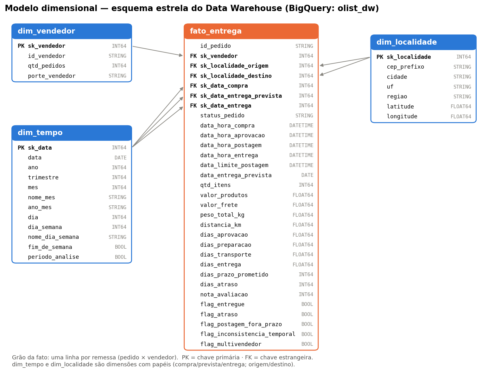
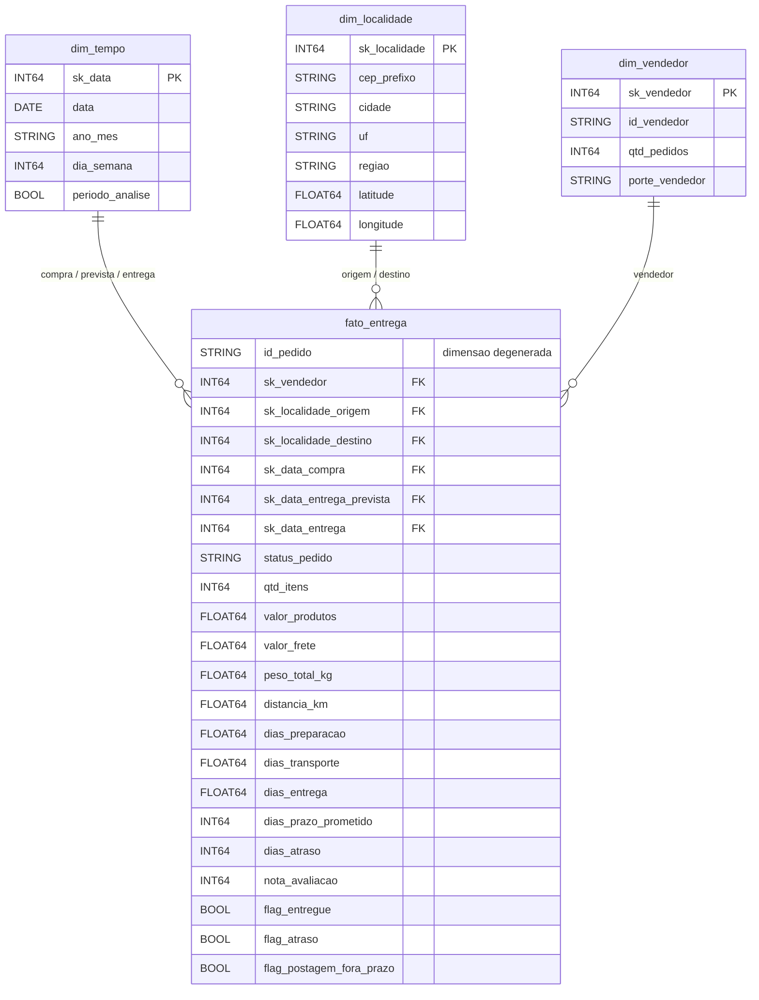
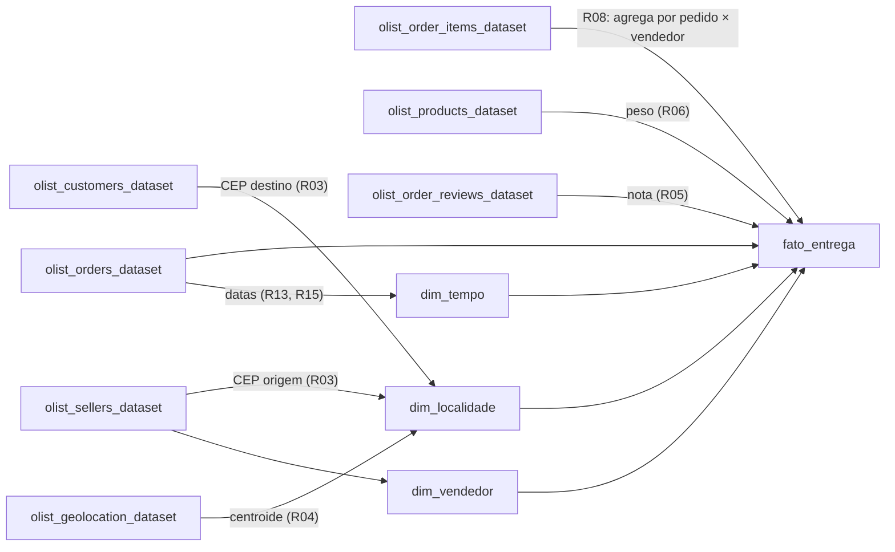

# Modelo de dados — esquema estrela (`olist_dw`)

## Decisão de modelagem

O Data Warehouse segue um **esquema estrela** (Kimball) com uma tabela fato e três dimensões desnormalizadas. As dimensões são pequenas (milhares de linhas): normalizá-las em *snowflake* só acrescentaria junções, sem ganho analítico.

### Grão da fato: uma linha por **remessa** (pedido × vendedor)

| Alternativa de grão | Problema | Decisão |
|---|---|---|
| Item do pedido | Repetiria as datas e a nota do pedido em cada item e inflaria as contagens de entregas. | Descartada |
| Pedido | Perderia o vendedor nos pedidos com itens de mais de um vendedor; o prazo-limite de postagem e a origem geográfica são do vendedor. | Descartada |
| **Remessa (pedido × vendedor)** | O vendedor é quem prepara e posta o pacote; é a unidade logística real. | **Adotada** |

Nos poucos pedidos com mais de um vendedor, as datas e a nota do pedido se repetem entre as remessas. A análise de satisfação (P5) agrega por pedido antes de calcular, e a fato traz `flag_multivendedor` para auditoria.

### Tabelas

| Tabela | Tipo | Conteúdo |
|---|---|---|
| `fato_entrega` | Fato | Uma linha por remessa. **Aditivas:** `qtd_itens`, `valor_produtos`, `valor_frete`, `peso_total_kg`. **Não aditivas** (usar média, mediana ou percentil): `distancia_km`, `dias_*`, `nota_avaliacao`. **Indicadores:** `flag_*`. **Dimensão degenerada:** `id_pedido`. |
| `dim_tempo` | Dimensão com papéis | Um dia por linha. Três papéis na fato: `sk_data_compra`, `sk_data_entrega_prevista`, `sk_data_entrega`. |
| `dim_localidade` | Dimensão com papéis | Um CEP-prefixo por linha, com cidade, UF, região e centroide. Dois papéis: `sk_localidade_origem` (vendedor) e `sk_localidade_destino` (cliente). |
| `dim_vendedor` | Dimensão | Um vendedor por linha, com volume histórico e porte. |

Tabelas de metadados carregadas no mesmo dataset: `meta_catalogo_dados`, `meta_log_transformacoes`, `meta_coleta`, `meta_perfil_qualidade` e `meta_verificacoes_qualidade`.

## Diagrama entidade-relacionamento

O diagrama acima mostra os atributos principais. A lista completa, com domínio e linhagem de cada atributo, está no [Catálogo de Dados](catalogo_dados.md), e o esquema equivalente em DDL está em [`scripts/ddl_modelo_estrela.sql`](../scripts/ddl_modelo_estrela.sql).

## Linhagem (visão geral)

